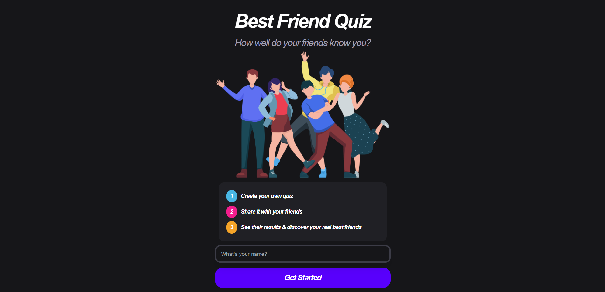
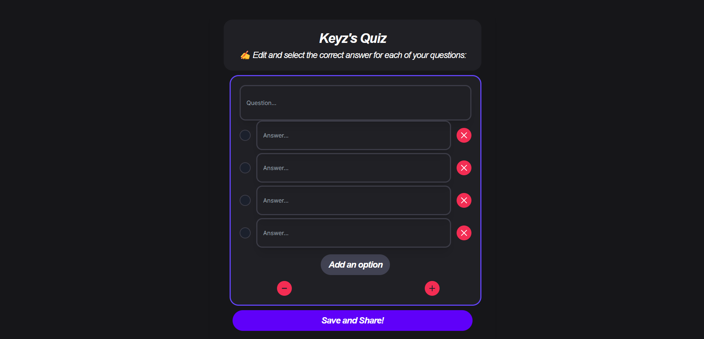

# QuizzApp - Quiz Creation and Sharing Platform

## Description
QuizzApp is an exciting quiz creation and gaming platform that allows you to design and share custom quizzes with your friends and followers. Create challenging questions, select the correct answers, and watch as your friends take on your quizzes.

## Key Features
- **Quiz Creator:** Easily design your own quizzes, choose the number of answers, and mark the correct ones.
- **Fun Gameplay:** Participate in quizzes created by other users and test your knowledge.
- **Share Your Quizzes:** Share your unique quizzes with friends and family through personalized links.
- **Scoring and Leaderboards:** Keep track of your score and compete for the top spot on the leaderboards.
- **User-Friendly Interface:** Enjoy an intuitive and attractive user interface that makes quiz creation and gameplay straightforward.

## Demo
To try QuizzApp in action, visit our online platform: [QuizzApp on Vercel](https://quizapp-nu-blue.vercel.app/)

## Screenshots

_(Main Page)_

_(Quiz Creation System)_

## Usage Instructions
1. Visit the [QuizzApp website](https://quizapp-nu-blue.vercel.app/).
2. Enter your name.
3. Create your own quizzes.
4. Share your unique quizzes with friends and followers.
5. Enjoy a fun and educational experience of question and answer games.

## Technologies Used
- HTML5, CSS3, TypeScript
- Firebase, NextJS
- Tailwind

## Contribution
We appreciate your contributions! If you want to participate in the development of QuizzApp, follow these steps:
1. Fork the repository.
2. Create a branch for your changes: `git checkout -b your-branch`.
3. Make your changes and commit: `git commit -m "Description of your changes"`.
4. Push your changes to your fork: `git push origin your-branch`.
5. Open a pull request in this repository.

## Author
- KeyzDev

## License
This project is licensed under the MIT License. See the [LICENSE](LICENSE) file for more details.

© 2023 QuizzApp. All rights reserved.
